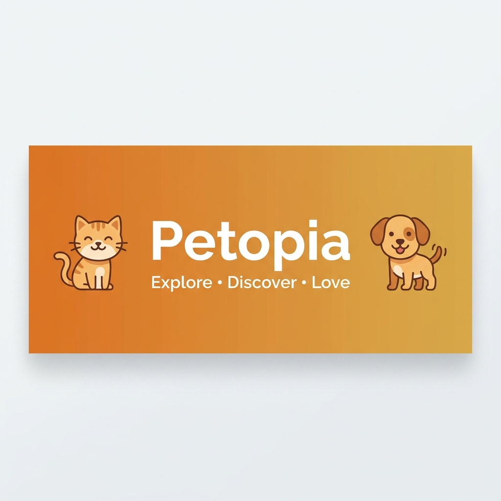

<p align="center">
  
</p>

<p align="center">
  <b>A beautiful Flutter app for exploring cat & dog breeds, discovering pet images, and managing your favorites.</b>
</p>

<p align="center">
  
  
  
  
  
</p>

---

## 📖 Overview

**Petopia** is a feature-rich Flutter mobile application that allows users to explore various cat and dog breeds, view detailed breed information, browse high-quality pet images, save favorites, and download images to their device gallery. The app integrates with [TheCatAPI](https://thecatapi.com/) and [TheDogAPI](https://thedogapi.com/) for breed data and images, and uses **Firebase** for authentication, cloud storage, and data persistence.

---

## ✨ Features

| Feature | Description |
|---------|-------------|
| 🔐 **Authentication** | User registration & login with Firebase Auth |
| 🐱 **Cat Breeds** | Browse a comprehensive list of cat breeds with detailed info |
| 🐶 **Dog Breeds** | Browse a comprehensive list of dog breeds with detailed info |
| 🔍 **Explore** | Discover random cat & dog images with a staggered grid layout |
| ❤️ **Favorites** | Add/remove pets to favorites (separate lists for cats & dogs) |
| 📸 **Image Gallery** | Full-screen image viewer with Hero animation transitions |
| 💾 **Image Download** | Download pet images directly to device gallery |
| 🔎 **Search** | Search breeds by name with a custom search bar |
| 🖼️ **Similar Images** | View similar breed images in an interactive carousel |
| 👤 **Profile** | User profile management |
| 🎨 **Theming** | Warm orange-themed UI with light/dark mode support |
| ✨ **Animations** | Smooth Lottie animations for splash, loading, and placeholders |

---

## 📱 App Screens

| Splash | Explore | Breeds | Details | Favorites |
|--------|---------|--------|---------|-----------|
| Animated splash screen with Lottie | Staggered grid of pet images | List of cat/dog breeds | Breed details with characteristics | Manage your favorite pets |

---

## 🏗️ Architecture

Petopia follows **Clean Architecture** principles with a **feature-first** folder structure, ensuring scalability, testability, and separation of concerns.

```
lib/
├── Core/
│   ├── errors/          # Failure classes & error handling
│   ├── network/         # API constants & endpoint definitions
│   ├── shared/          # Shared utilities
│   ├── theme/           # App theming (light & dark modes)
│   ├── utils/           # API service, styles, service locator
│   └── widgets/         # Reusable widgets (buttons, text fields, etc.)
│
├── Features/
│   ├── AuthFeature/     # Authentication (Login, Register, Signing)
│   │   └── presentation/
│   │       └── views/
│   │
│   ├── BottomNavBar/    # Bottom navigation bar with FAB
│   │
│   ├── Cats/            # Cat breeds feature
│   │   ├── data/
│   │   │   ├── CatsRepo/    # Repository pattern (abstract + implementation)
│   │   │   └── Models/      # Cat breed & search data models
│   │   └── presentation/
│   │       ├── controller/  # BLoC Cubits (CatsBreeds, SimilarImages)
│   │       └── views/       # UI screens & widgets
│   │
│   ├── Dogs/            # Dog breeds feature (mirrors Cats structure)
│   │   ├── data/
│   │   │   ├── DogsRepo/
│   │   │   └── Models/
│   │   └── presentation/
│   │       ├── controller/
│   │       └── views/
│   │
│   ├── Explore/         # Explore/discover feature
│   │   ├── data/
│   │   │   ├── ExploreModels/
│   │   │   └── ExploreRepo/
│   │   └── presentation/
│   │       ├── controller/
│   │       └── views/
│   │
│   ├── Favorit/         # Favorites management
│   │   ├── data/
│   │   │   ├── FavRepo/
│   │   │   └── Models/
│   │   └── presentation/
│   │       ├── controller/  # Separate cubits for cat & dog favorites
│   │       └── views/
│   │
│   ├── Profile/         # User profile
│   │   └── presentation/
│   │       └── views/
│   │
│   └── splash/          # Splash screen with Lottie animation
│       └── presentation/
│           └── View/
│
├── constants.dart
├── firebase_options.dart
└── main.dart
```

---

## 🛠️ Tech Stack

### Core
| Technology | Purpose |
|-----------|---------|
| **Flutter** | Cross-platform UI framework |
| **Dart** | Programming language |

### State Management
| Technology | Purpose |
|-----------|---------|
| **flutter_bloc / Cubit** | Reactive state management |
| **get_it** | Dependency injection / Service locator |

### Backend & Data
| Technology | Purpose |
|-----------|---------|
| **Firebase Auth** | User authentication |
| **Cloud Firestore** | Cloud database |
| **Firebase Storage** | File/image storage |
| **Dio** | HTTP client for REST API calls |
| **TheCatAPI** | Cat breeds data & images |
| **TheDogAPI** | Dog breeds data & images |

### UI & UX
| Technology | Purpose |
|-----------|---------|
| **cached_network_image** | Efficient image loading & caching |
| **Lottie** | High-quality animations |
| **animate_do** | Entrance animations |
| **carousel_slider** | Image carousels |
| **flutter_staggered_grid_view** | Staggered/masonry grid layouts |
| **shimmer** | Loading skeleton effects |
| **font_awesome_flutter** | Icon library |
| **google_fonts** | Typography |
| **percent_indicator** | Progress indicators for breed stats |

### Utilities
| Technology | Purpose |
|-----------|---------|
| **gallery_saver_plus** | Save images to device gallery |
| **image_picker** | Pick images from camera/gallery |
| **shared_preferences** | Local key-value storage |
| **url_launcher** | Open external URLs |
| **path_provider** | Access device file system paths |
| **dartz** | Functional programming (Either type for error handling) |
| **equatable** | Value equality for state objects |

---

## 🧩 Design Patterns

- **Repository Pattern** — Abstracts data sources behind clean interfaces (`CatsRepo`, `DogsRepo`, `ExploreRepo`, `FavRepo`)
- **BLoC / Cubit Pattern** — Manages UI state reactively with clear separation from business logic
- **Dependency Injection** — Uses `GetIt` as a service locator for loose coupling
- **Functional Error Handling** — Uses `dartz` `Either` type to handle success/failure without exceptions
- **Factory Pattern** — `ServerFailure.fromDioError()` for structured error mapping

---

## 🚀 Getting Started

### Prerequisites

- Flutter SDK `>=3.3.0`
- Dart SDK `>=3.3.0`
- Android Studio / VS Code
- A Firebase project configured for this app

### Installation

1. **Clone the repository**
   ```bash
   git clone https://github.com/YOUR_USERNAME/petopia.git
   cd petopia
   ```

2. **Install dependencies**
   ```bash
   flutter pub get
   ```

3. **Firebase Setup**
   - Create a Firebase project at [Firebase Console](https://console.firebase.google.com/)
   - Enable **Authentication** (Email/Password)
   - Enable **Cloud Firestore**
   - Enable **Firebase Storage**
   - Run FlutterFire CLI to configure:
     ```bash
     flutterfire configure
     ```

4. **Run the app**
   ```bash
   flutter run
   ```

---

## 📂 API Integration

Petopia integrates with two external APIs:

| API | Base URL | Usage |
|-----|----------|-------|
| **TheCatAPI** | `https://api.thecatapi.com/v1` | Cat breeds, images, favorites |
| **TheDogAPI** | `https://api.thedogapi.com/v1` | Dog breeds, images, favorites |

### Endpoints Used
- `GET /breeds` — Fetch all breeds
- `GET /images/search` — Search breed images
- `GET /favourites` — Get user favorites
- `POST /favourites` — Add to favorites
- `DELETE /favourites/{id}` — Remove from favorites

---

## 🎨 Theme

Petopia uses a warm, inviting color palette:

| Color | Hex Code | Usage |
|-------|----------|-------|
| 🟠 Primary Orange | `#D9832C` | Primary brand color, buttons, nav bar |
| 🟡 Secondary Gold | `#E3A456` | Accent elements, highlights |
| ⚪ Surface White | `#FFFFFF` | Background surfaces |
| ⚫ Dark Mode | `Grey.shade900` | Dark theme background |

---

## 🤝 Contributing

Contributions are welcome! Please feel free to submit a Pull Request.

1. Fork the repository
2. Create your feature branch (`git checkout -b feature/amazing-feature`)
3. Commit your changes (`git commit -m 'Add some amazing feature'`)
4. Push to the branch (`git push origin feature/amazing-feature`)
5. Open a Pull Request

---

<p align="center">
  Made with ❤️ and Flutter
</p>
